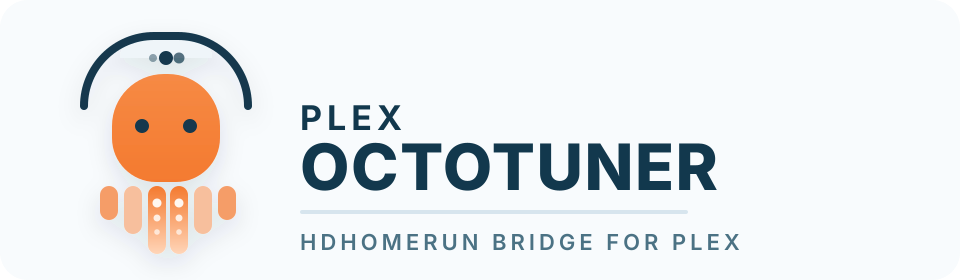
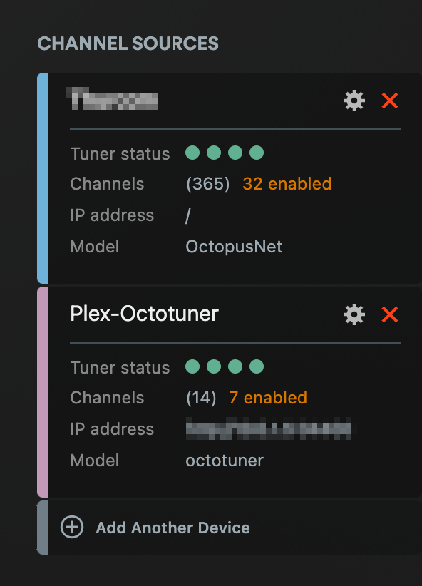

<p>
<a href="https://codecov.io/gh/onmomo/plex-octotuner" target="_blank" rel="noopener noreferrer"></a>
<a href="https://hub.docker.com/r/onmomo/plex-octotuner/tags" target="_blank" rel="noopener noreferrer"></a>
<a href="https://github.com/sponsors/onmomo" target="_blank" rel="noopener noreferrer"></a>
</p>

<p align="center">
  
</p>

# Plex Octotuner

Go service that exposes an octopus-generated M3U playlist as a single HDHomeRun-compatible tuner for Plex.

## Plex Octotuner bridge shown in PMS Live TV & DVR settings




## Compatibility

- Tested with Octopus Net by Digital Devices using M3U playlists that expose `rtsp://` streams
- May also work with other M3U playlists that expose `rtsp://` streams, but that compatibility is not guaranteed and has not been validated broadly

## Supported deployment contract

v1 supports same-LAN Linux Docker deployments with `--network host` only.

- Supported: Linux host networking on the same LAN as Plex
- Not supported in v1: Docker bridge networking, published-port-only setups, or Docker Desktop host emulation
- Why: Plex discovery depends on SSDP multicast and HDHomeRun UDP discovery traffic, so bridge/published-port mode is not a reliable v1 path

## Setup

1. Run `cp .env.example .env`.
2. Fill in the required values:

| Variable | Required | Notes |
| --- | --- | --- |
| `M3U_URL` | Yes | octopus-generated playlist URL |
| `ADVERTISED_BASE_URL` | Yes | LAN-reachable origin Plex uses, with explicit port and no path/query |
| `HDHR_DEVICE_ID` | No | Defaults to `105A1B22`; override with a unique 8-character uppercase hexadecimal ID on your LAN |
| `HDHR_DEVICE_AUTH` | No | Defaults to `octotuner-<HDHR_DEVICE_ID>` |
| `HDHR_FRIENDLY_NAME` | No | Defaults to `octotuner` |
| `HDHR_TUNER_COUNT` | No | Defaults to `4` |
| `PLAYLIST_REFRESH_SECONDS` | No | Defaults to `300` |
| `SERVER_PORT` | No | Defaults to `34400`; must match `PORT` and the port in `ADVERTISED_BASE_URL` |

## Docker

Published images are intended to be available as:

- `onmomo/plex-octotuner:latest`
- `onmomo/plex-octotuner:<version>`

The GitHub Actions release flow is designed to bump the minor version automatically on every merge into `develop` and publish both tags to Docker Hub.

Run the published image on a Linux Docker host with host networking:

```bash
docker run --rm --network host --env-file .env onmomo/plex-octotuner:latest
```

Or pin a specific published version:

```bash
docker run --rm --network host --env-file .env onmomo/plex-octotuner:<version>
```

Build the production image locally:

```bash
docker build -t plex-octotuner .
```

If you are building on one architecture and running on another, build for the target platform explicitly. For example, from Apple Silicon for an x86_64 Linux host:

```bash
docker buildx build --platform linux/amd64 -t plex-octotuner --load .
```

Run the locally built image:

```bash
docker run --rm --network host --env-file .env plex-octotuner
```

Or inject non-default values directly on the command line:

```bash
docker run --rm --network host \
  -e M3U_URL='http://192.168.1.50/channels/m3u' \
  -e ADVERTISED_BASE_URL='http://192.168.1.20:34400' \
  -e HDHR_TUNER_COUNT='8' \
  -e SERVER_PORT='34400' \
  plex-octotuner
```

The supported command above assumes the ports in `.env` stay aligned:

- `SERVER_PORT` is the validated bridge port
- `ADVERTISED_BASE_URL` must use the same port Plex will reach on the LAN
- `ADVERTISED_BASE_URL` must use an IPv4 address that belongs to the host running the container

## Local verification

Automated checks for the Go runtime path:

- `go test ./...`
- `go test -race ./internal/rtsp`
- `go build ./cmd/plex-octotuner`
- `docker build -t plex-octotuner .`

Manual Plex verification on the supported Docker path:

1. Start the container with `--network host` and confirm startup succeeds with no config or playlist-load errors.
2. In Plex DVR setup, add the tuner manually with `http://<bridge-host-ip>:34400` if same-host auto-discovery is unreliable.
3. Confirm Plex requests `/device.xml`, `/discover.json`, `/lineup_status.json`, and `/lineup.json`.
4. Start playback for a channel and confirm requests hit `/auto/v<channel-id>`.
5. For `rtsp://` playlist entries, confirm the bridge logs `rtsp relay media started` and Plex plays the channel over HTTP MPEG-TS.
6. If playback artifacts appear, check for `rtsp relay detected RTP sequence gap` or `rtsp relay detected MPEG-TS continuity mismatch`.

## Deployment notes

- Recommended runtime: a wired Linux host with Docker `--network host`
- Best observed playback quality: run the bridge on the same Linux host as Plex Media Server
- Same-host auto-discovery can still be less reliable than manual tuner add in Plex
- Octopus descrambled RTSP playback currently falls back to UDP transport because the tuner rejects the tested RTSP interleaved TCP `SETUP` variants with `461 Unsupported Transport`
- This project is independent and is not affiliated with, endorsed by, or supported by Digital Devices or any other device vendor

## Credits

- [`xTeVe`](https://github.com/xteve-project/xTeVe) helped inform the broader IPTV-to-Plex bridge space and the practical shape of a Plex-facing tuner bridge.
- [`antennas`](https://github.com/jfarseneau/antennas) provided useful HDHomeRun bridge inspiration, especially around presenting a compatible tuner surface to Plex.
